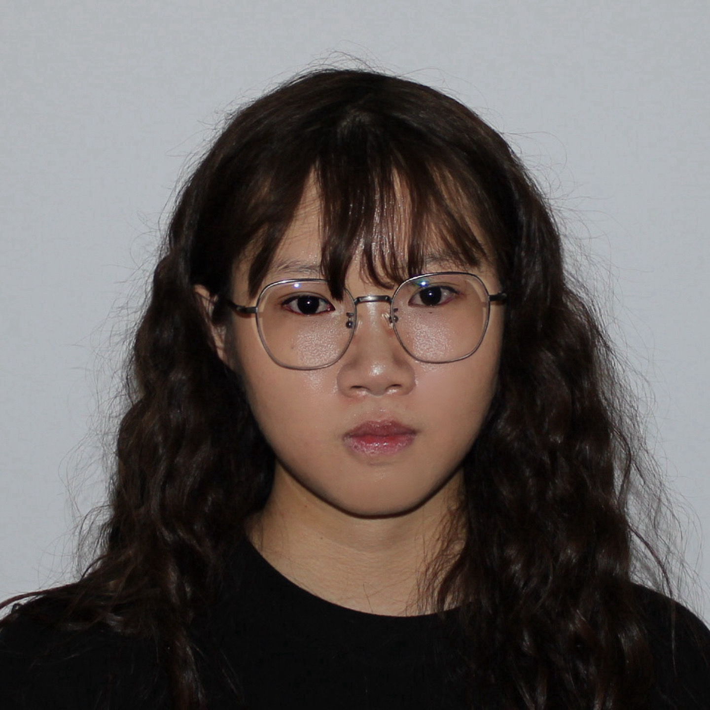

# Yue Wan (Zoe)

MSE at Johns Hopkins University. Love doing Computational Neuroscience/Biomedical Data Science Research 

[Email](mailto:ywan23@jh.edu) | [GitHub](https://github.com/YueWan1) | [LinkedIn](www.linkedin.com/in/zoewan-71a956284) | [Google Scholar](https://scholar.google.com/citations?hl=en&user=uKN8SV8AAAAJ)

---

## About Me

I am a Master's graduate from [University Name], where I specialized in [your specific area]. I am currently seeking PhD opportunities to advance my research in [your main research area].

At [University Name], I was advised by [Professor Name]. My research focuses on [brief description of your main research direction]. Prior to my Master's studies, I completed my undergraduate degree in [Major] at [University Name], where I developed a strong foundation in [relevant skills/knowledge].

---

## Research Interests

My research interests lie at the intersection of [Field A] and [Field B]. Currently, I focus on the following areas:

- **[Research Area 1]**  
  [2-3 sentences explaining this area. What problems are you interested in? What approaches do you use? Why does this matter? Follow Shiyao's style - be specific about methods and impact]

- **[Research Area 2]**  
  [2-3 sentences. How does this relate to real-world applications? What computational/theoretical methods are you using? What questions are you trying to answer?]

Together, these research directions form my broader agenda: [1-2 sentences about your overarching research vision and how these areas connect].

---

## Publications

**[Your Paper Title]**  
**Yue Wan**, Co-author 2, Co-author 3  
*In Preparation for Submission to [CompBio]*  
[[arXiv](https://arxiv.org/abs/XXXX.XXXXX)] [[PDF](./papers/yourpaper.pdf)]

---

## Selected Projects

**[[Generic-Expert Prompt Tuning for Parameter-Efficient Nuclei Segmentation](https://github.com/yourusername/project1)]** 

**[[Detecting Face Images Generated by AI](https://github.com/YueWan1/Detecting-Face-Images-Generated-by-AI)]**

---

Last updated: October 2025

